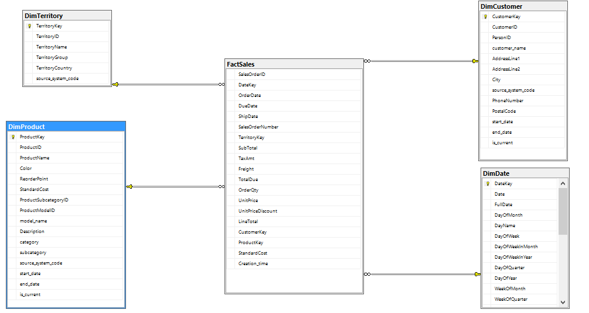

# ETL Sales data mart using SSIS

### Overview
The primary goal of this project is to transform the AdventureWorks Entity-Relationship Diagram (ERD) into a sales data warehouse for comprehensive analysis and reporting. The objective is to answer key business questions, such as:

* What is the trend in our sales over time?
* How does the number of orders change?
* Which products/categories contribute most to our sales?
* What is the total number of customers, and who are our loyal customers?
* How are our customers segmented based on their location?
* Answering these questions aims to enhance business performance and track essential Key Performance Indicators (KPIs).

### Transformation Process

#### DimCustomer
* Extracted relevant data from various tables.
* Implemented a Slowly Changing Dimension (SCD) for Dim Customers.
* Utilized CustomerID as the business key to track changes.
* Implemented Type 2 SCD for phone number changes, including start time, end time, and is current columns.
* Applied Type 1 SCD to update address line, city, and customer name.
* Introduced a surrogate key as an identity column for Dim Customer.

#### DimProduct
* Applied Type 2 SCD for the reorder point to track changes, including start time, end time, and is current columns.
* Employed Type 1 SCD to update category, color, description, model name, product name, standard cost, and subcategory.
* Utilized a surrogate key as an identity column for Dim Product.

#### FactSales
* Populated the Fact Sales table using the Sales OrderID table.
* Matched each dimension to obtain the Dim Key using a lookup component.
* Loaded the final data into the Fact Sales table.

#### Business Impact

This comprehensive transformation enables robust analysis and reporting, empowering the organization to make informed decisions. By addressing key business questions, the data warehouse facilitates tracking sales trends, understanding customer behavior, and optimizing product offerings. The implementation of SCDs ensures accurate historical data tracking, contributing to a more reliable and insightful data model.

